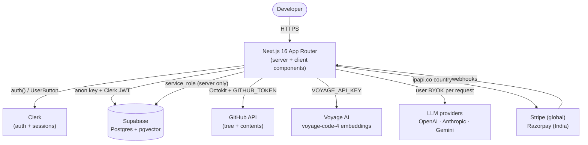
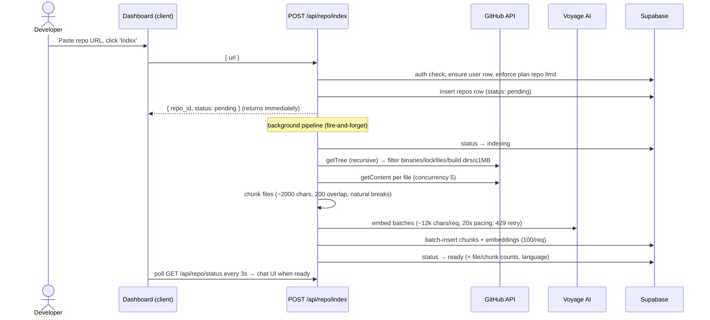
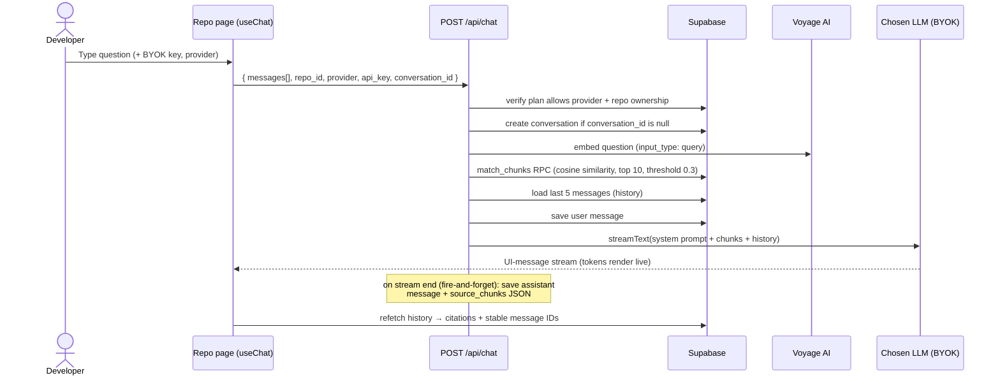
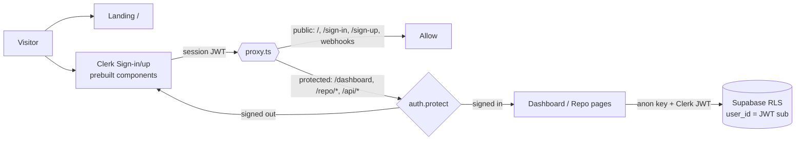
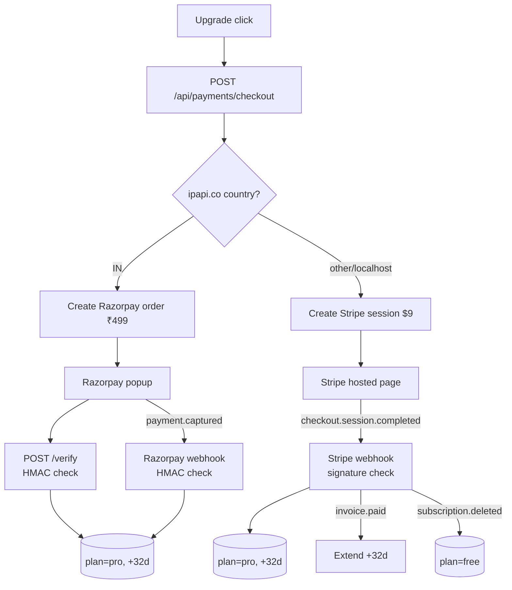

<div align="center">

# DevAsk — Understand Any Codebase in Minutes

**Paste a GitHub repo URL and have a real, multi-turn conversation with the entire codebase.**

No IDE. No setup. Just a URL — with source-file citations on every answer.


[Features](#-features) · [Architecture](#-architecture) · [How it works](#-how-it-works) · [Getting started](#-getting-started) · [API reference](#-api-reference) · [Troubleshooting](#-troubleshooting)

</div>

---

## Table of contents

- [Why DevAsk](#why-devask)
- [Features](#-features)
- [Architecture](#-architecture)
- [How it works](#-how-it-works)
  - [Repository indexing flow](#1-repository-indexing-flow)
  - [Chat / RAG flow](#2-chat--rag-flow)
  - [Authentication flow](#3-authentication-flow)
  - [Payments flow](#4-payments-flow)
- [Tech stack](#-tech-stack)
- [Project structure](#-project-structure)
- [Database](#-database)
- [Getting started](#-getting-started)
- [Usage](#-usage)
- [API reference](#-api-reference)
- [Configuration & tuning](#-configuration--tuning)
- [Key implementation notes](#-key-implementation-notes)
- [Troubleshooting](#-troubleshooting)
- [Scripts](#-scripts)
- [Known limitations & roadmap](#-known-limitations--roadmap)

---

## Why DevAsk

Pasting a repo URL into a general LLM gets you a README summary and guesses. DevAsk instead **recursively crawls the whole file tree, chunks and embeds every file into pgvector**, and retrieves real code context per question — so answers cite the exact files they came from.

| General LLMs | DevAsk |
|---|---|
| Fetch README + a few visible files | Crawls the complete file tree via GitHub API |
| Hit context limits on large repos | Indexes everything into pgvector — no context limits |
| No memory between sessions | Persistent index + full conversation history |
| Can't access private repos | Private repos via token (per-user OAuth sync planned) |
| No source citations | Citations with similarity scores on every answer |
| Hallucinate file contents | Real semantic search per question |

## ✨ Features

- **Full RAG indexing** — every file chunked, embedded (Voyage `voyage-code-4`), stored in pgvector.
- **Streaming chat** — token-by-token responses via the Vercel AI SDK.
- **Source citations** — each answer lists files used as context, with match % and snippet viewer.
- **Codebase file explorer** — searchable tree; click any file to view its indexed contents.
- **BYOK (Bring Your Own Key)** — OpenAI / Anthropic / Google keys are used once per request, never stored.
- **Multi-provider LLM** — GPT-4o, Claude Sonnet, Gemini Flash behind one streaming interface.
- **Private repos** — server-side GitHub token support (5,000 req/hr vs 60 anonymous).
- **Plans & payments** — Free vs Pro with automatic Stripe (global, $9/mo) / Razorpay (India, ₹499/mo) routing by IP geolocation.
- **Dark developer UI** — Tailwind v4 + shadcn, Geist fonts, violet glow aesthetic.

## 🏗️ Architecture



**Component responsibilities:**

| Layer | Lives in | Does |
|---|---|---|
| Pages | `app/` | Landing (`/`), auth (`/sign-in`, `/sign-up`), dashboard (`/dashboard`), chat (`/repo/[id]`) |
| Route guard | `proxy.ts` | Clerk protection (Next.js 16 file convention — `middleware.ts` is deprecated) |
| API routes | `app/api/` | `chat`, `repo/index`, `repo/status`, `payments/*` — all server-side, Clerk-authenticated |
| GitHub ingest | `lib/github/client.ts` | Tree crawl + content fetch, exclusion filters, token handling |
| RAG | `lib/rag/` | `chunker` (split) → `embedder` (Voyage) → `retriever` (pgvector search + prompt build) |
| LLM router | `lib/llm/` | One `streamChat()` over OpenAI / Anthropic / Gemini adapters (BYOK) |
| Payments | `lib/payments/` | Geo-routing + Stripe/Razorpay adapters + webhook verification |
| Database | `lib/supabase/` | Browser client (RLS-bound), service client (server-only), schema + migrations |
| UI | `components/` | Chat, file explorer, provider selector, repo cards, shadcn primitives |
| Contract | `types/index.ts` | Single source of truth: entities, API shapes, plan limits, default models |

## 🔄 How it works

### 1. Repository indexing flow



> ⚠️ Indexing runs **in-request, fire-and-forget** (no job queue). Large repos on serverless hosts risk function timeouts — see [Known limitations](#-known-limitations--roadmap).

### 2. Chat / RAG flow



Key details:

- The client sends the AI SDK transport envelope (`messages[]` + top-level `repo_id`/`provider`/`api_key`/`conversation_id`); the server also accepts a legacy top-level `message` string.
- The transport is **static** — per-request fields travel via `sendMessage(text, { body })`, because `useChat` captures the transport instance once on first render (a `body()` closure over state would send stale values forever).
- The server returns the stream with an `x-conversation-id` header so the client learns newly created conversation IDs.

### 3. Authentication flow



- Server components/layouts call `auth()`; API routes reject unauthenticated callers (browser hits get a Clerk redirect via `auth.protect()` in `proxy.ts`).
- The browser Supabase client attaches the Clerk session JWT to every request; Supabase validates it via the Clerk JWKS configured under **Authentication → Third-Party Auth**, and RLS policies isolate each user's rows.
- Webhook routes are explicitly public and authenticate via provider signatures instead.

### 4. Payments flow



Routing is fully automatic — the user never picks a provider.

## 🧰 Tech stack

| Concern | Choice | Notes |
|---|---|---|
| Framework | Next.js 16.2.9 (App Router, Turbopack) | `proxy.ts` replaces `middleware.ts`; `force-dynamic` on app pages |
| UI | React 19, Tailwind CSS v4, shadcn (radix-nova), Lucide | Dark mode default, Geist fonts |
| Auth | Clerk `@clerk/nextjs` v7 | Prebuilt components + `auth()` + third-party JWT for Supabase |
| Database | Supabase Postgres + pgvector | 5 tables, RLS everywhere, `match_chunks` RPC |
| Embeddings | Voyage AI `voyage-code-4`, 1024 dims | Raw REST (no SDK dep), platform key, free tier friendly |
| Chat LLM | Vercel AI SDK (`ai` + `@ai-sdk/*`) | BYOK: GPT-4o, Claude Sonnet 4, Gemini 2.5 Flash |
| GitHub | Octokit | Token-authenticated crawl, 401/403/429 abort loudly |
| State (client) | TanStack Query | Dashboard server-state; chat via `useChat` |
| Payments | Stripe + Razorpay, ipapi.co geo-detect | Webhooks update plan + 32-day expiry |
| Markdown/code | react-markdown + remark-gfm, shiki | `shiki` externalized via `serverExternalPackages` |

## 📁 Project structure

```text
DevAsk/
├── app/                          # Next.js App Router
│   ├── page.tsx                  # Landing page (public, marketing + pricing)
│   ├── layout.tsx                # Root: ClerkProvider, Geist fonts, dark mode
│   ├── globals.css               # Tailwind v4 theme, custom tokens & chat prose
│   ├── (auth)/sign-in|sign-up/   # Clerk prebuilt components (catch-all routes)
│   ├── dashboard/                # Authed repo grid: list/add/reindex/delete/upgrade
│   ├── repo/[id]/                # Authed chat: layout guards ownership, page hosts chat
│   └── api/
│       ├── chat/route.ts         # RAG chat (validate → retrieve → stream → persist)
│       ├── repo/index/route.ts   # Start indexing (returns pending, pipelines async)
│       ├── repo/status/route.ts  # Poll index status + counts (client polls 3s)
│       └── payments/
│           ├── checkout/route.ts # Geo-routed checkout creation
│           ├── stripe/webhook/   # completed/paid/deleted → plan lifecycle
│           └── razorpay/
│               ├── verify/route.ts   # Immediate HMAC verify → instant Pro
│               └── webhook/route.ts  # payment.captured → Pro (backup path)
├── components/
│   ├── chat/                     # chat-input, message-list, message-bubble, citations
│   ├── file-explorer/            # Flat paths → nested tree + search
│   ├── provider-selector/        # LLM picker (Pro-gated) + BYOK key input
│   ├── repo-card/                # Status badge, metadata, reindex/delete/chat actions
│   ├── providers.tsx             # TanStack Query provider (dashboard/repo only)
│   └── ui/                       # shadcn primitives
├── lib/
│   ├── github/client.ts          # Octokit: parse URL, tree+content fetch, lang detect
│   ├── rag/
│   │   ├── chunker.ts            # ~2000-char chunks, 200 overlap, natural breaks
│   │   ├── embedder.ts           # Voyage batch embed + 20s pacing + 429 retry
│   │   └── retriever.ts          # match_chunks RPC + system-prompt builder
│   ├── llm/
│   │   ├── index.ts              # streamChat router + provider display names
│   │   ├── extract-user-text.ts  # Latest user text from transport messages[]
│   │   └── providers/            # openai.ts, anthropic.ts, gemini.ts (BYOK adapters)
│   ├── payments/                 # index.ts (geo-route), stripe.ts, razorpay.ts
│   ├── supabase/
│   │   ├── client.ts             # Browser singleton (RLS-bound, Clerk JWT injected)
│   │   ├── service.ts            # Service-role client (SERVER ONLY, bypasses RLS)
│   │   ├── schema.sql            # Full schema: tables, indexes, RLS, RPC
│   │   └── migration-001-*.sql   # 1536/768 → 1024 vector migration
│   └── utils.ts                  # cn() (clsx + tailwind-merge)
├── types/index.ts                # Shared contract: entities, API shapes, plans, models
├── proxy.ts                      # Clerk route guard (protected vs public matchers)
├── public/                       # Static assets
├── .env.example                  # All env vars, documented (copy to .env.local)
├── components.json               # shadcn config
├── next.config.ts                # shiki externalized, avatar image hosts
└── package.json                  # Scripts: dev / build / start / lint
```

## 🗄️ Database

Defined in [`lib/supabase/schema.sql`](lib/supabase/schema.sql) — run it once in the Supabase SQL Editor. Requires the **pgvector** extension.

| Table | Purpose | Key columns |
|---|---|---|
| `users` | Clerk-linked profile + subscription | `id` (Clerk ID), `plan`, `payment_provider`, Stripe/Razorpay IDs, `plan_expires_at` |
| `repos` | Indexed repositories | `id` (uuid), `user_id`, `url/owner/name`, `index_status` (`pending\|indexing\|ready\|failed`), `metadata` (jsonb) |
| `chunks` | RAG vector store | `repo_id` (cascade delete), `file_path`, `content`, `embedding vector(1024)` |
| `conversations` | Chat sessions | `repo_id`, `user_id`, `is_public` (shareable links) |
| `messages` | Chat history | `conversation_id` (cascade), `role`, `content`, `source_chunks` (jsonb) |

- **Vector search:** `match_chunks(query_embedding, repo_id, threshold, count)` RPC does cosine-similarity search (`<=>`) scoped per repo; an IVFFlat index accelerates it.
- **RLS:** enabled on all tables; policies bind rows to `auth.jwt() ->> 'sub'` (the Clerk user ID) — plus public-read for shared conversations. Service-role clients bypass RLS for indexing, chat, and webhooks.
- **Embeddings are server-side only** — never selected by browser queries.

---

## 🚀 Getting started

### Prerequisites

- **Node.js 20.9+** (v20.19+ verified; v22+ silences a transitive engine warning)
- Accounts/keys: **Clerk**, **Supabase**, **Voyage AI** (free tier, no card), **GitHub** (PAT), optionally **Stripe**/**Razorpay**

### 1. Install

```bash
git clone <repo-url> && cd DevAsk
npm install
cp .env.example .env.local   # then fill in the values below
```

> If `npm ci` complains the lockfile is out of sync, use `npm install` (it re-syncs `package-lock.json`).

### 2. Environment variables

All 13 live in [`.env.example`](.env.example) with comments:

| Variable | Where to get it | Used for |
|---|---|---|
| `NEXT_PUBLIC_CLERK_PUBLISHABLE_KEY` | Clerk dashboard → API Keys | Browser auth |
| `CLERK_SECRET_KEY` | Clerk dashboard → API Keys | Server `auth()` |
| `NEXT_PUBLIC_SUPABASE_URL` | Supabase → Settings → API | Both clients |
| `NEXT_PUBLIC_SUPABASE_ANON_KEY` | Supabase → Settings → API | Browser client (RLS-bound) |
| `SUPABASE_SERVICE_ROLE_KEY` | Supabase → Settings → API | Server client (**secret**, bypasses RLS) |
| `VOYAGE_API_KEY` | [Voyage dashboard](https://dashboard.voyageai.com) → API keys | Platform embeddings (free tier) |
| `GITHUB_TOKEN` | GitHub → Settings → Personal access tokens (no scopes needed for public repos) | Indexing at 5,000 req/hr |
| `STRIPE_SECRET_KEY` | Stripe dashboard | Non-India checkout |
| `STRIPE_WEBHOOK_SECRET` | Stripe → Webhooks | Webhook verification |
| `RAZORPAY_KEY_ID` / `RAZORPAY_KEY_SECRET` | Razorpay dashboard | India orders + signature verify |
| `RAZORPAY_WEBHOOK_SECRET` | Razorpay → Webhooks | Webhook verification |
| `NEXT_PUBLIC_APP_URL` | — | Stripe success/cancel redirects (`http://localhost:3000` locally) |

### 3. Supabase setup (3 steps — all required)

1. **Schema:** in Supabase → SQL Editor, run [`lib/supabase/schema.sql`](lib/supabase/schema.sql) once (creates tables, RLS, `match_chunks` RPC).
   - Upgrading from an older checkout? Run [`lib/supabase/migration-001-voyage-1024.sql`](lib/supabase/migration-001-voyage-1024.sql) instead/after — it resizes `chunks.embedding` to `vector(1024)` (works from 1536 or 768) and replaces the RPC. Old vectors are deleted; repos must be re-indexed.
2. **Clerk trust:** in Supabase → **Authentication → Third-Party Auth**, enable the **Clerk** provider and set your Clerk domain (e.g. `https://<instance>.clerk.accounts.dev`). Without this, every browser read is denied by RLS (dashboard looks empty, repo pages hang on loading).
3. **pgvector:** enabled by the schema script (`create extension if not exists vector`) — no manual step.

### 4. Clerk setup

- Create an application, copy both API keys into `.env.local`.
- No custom JWT template needed — the native Supabase third-party auth validates standard Clerk session tokens via JWKS.

### 5. Run

```bash
npm run dev      # → http://localhost:3000
```

Sign up, paste a repo URL on the dashboard, wait for indexing, then chat. For payments testing, point Stripe/Razorpay webhooks at your dev tunnel (`/api/payments/stripe/webhook`, `/api/payments/razorpay/webhook`).

## 📖 Usage

| Action | How |
|---|---|
| Index a repo | Dashboard → **Add Repository** → paste `https://github.com/owner/name` |
| Track progress | Repo page polls `/api/repo/status` every 3s until `ready` |
| Chat | Open the repo → pick provider → enter BYOK key → ask (Enter to send) |
| View sources | Click any `[n] filename` citation chip under an answer |
| Browse files | Left explorer → search / click any file for full contents |
| Starter prompts | Empty chat shows 4 suggested architecture questions |
| Upgrade to Pro | Dashboard banner → automatic Stripe/Razorpay checkout |
| Re-index | Delete the repo card first, then re-add (avoids duplicate rows) |

**Plans** (enforced server-side in [`types/index.ts`](types/index.ts) → `PLAN_LIMITS`):

| | Free | Pro ($9 / ₹499 per mo) |
|---|---|---|
| Repos | 2, public only | Unlimited incl. private |
| LLM providers | OpenAI only | OpenAI + Anthropic + Gemini |
| History | Session-only | Persistent |
| Sharing / export | — | Shareable links + export |

## 🔌 API reference

All routes except webhooks require a Clerk session (browsers are redirected to sign-in; direct callers get 401/redirect).

| Method & path | Auth | Body / query | Returns |
|---|---|---|---|
| `POST /api/repo/index` | user | `{ url: "https://github.com/o/n" }` | `{ repo_id, status: "pending" }` |
| `GET /api/repo/status?repo_id=` | owner | query param | `{ index_status, file_count, chunk_count, metadata }` |
| `POST /api/chat` | owner | `{ messages[] }` (transport) **or** `{ message }` (direct), `repo_id`, `provider`, `api_key`, `conversation_id?` | UI-message stream + `x-conversation-id` header |
| `POST /api/payments/checkout` | user | `{}` (plan fixed to `pro`) | `{ provider, checkout_url }` **or** `{ provider, order_id, razorpay_key, amount, currency }` |
| `POST /api/payments/razorpay/verify` | user | `{ razorpay_order_id, razorpay_payment_id, razorpay_signature }` | `{ success: true }` |
| `POST /api/payments/stripe/webhook` | Stripe sig | Stripe event | `{ received: true }` |
| `POST /api/payments/razorpay/webhook` | Razorpay sig | Razorpay event | `{ received: true }` |

**Chat request notes:**

- `provider`: `anthropic` | `openai` | `gemini`; `api_key` is BYOK (never persisted); `message`/`messages` carry the question (see [transport note](#-key-implementation-notes)).
- `400 { error }` names exactly which required fields are missing.
- `403` when the provider isn't in your plan; `404` for repos you don't own.
- The stream is `toUIMessageStreamResponse()`; the assistant reply is persisted with `source_chunks` when streaming completes.

---

## ⚙️ Configuration & tuning

All knobs are constants near the top of their files — no config service:

| Knob | File | Default | Effect |
|---|---|---|---|
| Chunk size / overlap | `lib/rag/chunker.ts` | 2000 / 200 chars (~500/50 tokens) | Larger = more context per hit, fewer hits; overlap preserves boundary context |
| Embedding batch / pacing | `lib/rag/embedder.ts` | ~12k chars/req, 20s apart | Sustains ≈9k TPM under the Voyage free tier (3 RPM / 10k TPM) — relax if you raise limits |
| Retry | `lib/rag/embedder.ts` | 4 retries, honors `Retry-After` | Survives 429/5xx during bulk indexing |
| Retrieval top-K / threshold | `lib/rag/retriever.ts` | 10 chunks, 0.3 cosine | Raise K for broad questions; raise threshold to cut noise |
| History window | `app/api/chat/route.ts` | Last 5 messages | More = better follow-ups, higher per-message cost |
| GitHub fetch concurrency | `lib/github/client.ts` | 5 parallel | Higher = faster indexing, more rate-limit pressure |
| Excluded paths | `lib/github/client.ts` | `node_modules`, `.git`, `dist`, `build`, binaries, lockfiles… | Extend to skip generated code |
| Max file size | `lib/github/client.ts` | 1 MB | Larger files are skipped silently |
| Plan limits | `types/index.ts` (`PLAN_LIMITS`) | Free: 2 repos, OpenAI only | Single source of truth, enforced in API routes |
| Default models | `types/index.ts` (`DEFAULT_MODELS`) | GPT-4o, Claude Sonnet 4, Gemini 2.5 Flash | Overridable per request via `model` |

**Embedding model choice** (already decided for you): Voyage `voyage-code-4` at 1024 dims — code-specialized, and its free tier (≈200M tokens) covers dozens of large repos. Switching models later requires resizing `chunks.embedding`, recreating the IVFFlat index + RPC, and re-indexing everything (see the migration file for the pattern).

## 🧠 Key implementation notes

Read this before changing code — these are the non-obvious decisions and traps:

1. **Next.js 16 is not classic Next.js.** Route guards live in **`proxy.ts`** (the `middleware.ts` convention is deprecated). Per repo rules, read the relevant guide in `node_modules/next/dist/docs/` before writing framework code, and heed deprecation notices.
2. **Chat transport must stay static.** `useChat` instantiates its `Chat` (capturing your transport) exactly once on first render — a `body()` closure over React state sends **first-render values forever** (`api_key: ''` → 400). Request fields travel via `sendMessage(text, { body })` per request. Never move them back into the transport constructor.
3. **BYOK keys are never stored.** The key rides the request body, is used for one `streamChat()` call, and is discarded. The only platform-owned key is `VOYAGE_API_KEY` (embeddings).
4. **Two Supabase clients, never mixed:** `lib/supabase/client.ts` (browser, anon key, RLS-bound, Clerk JWT injected) vs `lib/supabase/service.ts` (server-only service role, bypasses RLS). Importing the service client in a client component would leak it to the browser.
5. **Indexing is fire-and-forget.** The API returns `pending` immediately and pipelines in the background; the client polls. There is no queue, no resume, no progress persistence beyond counts.
6. **Conversation continuity** relies on the `x-conversation-id` response header: the client sends `conversation_id: null` once, the server creates the conversation and returns its ID in the header, and subsequent sends reuse it.
7. **Reindex duplicates.** The dashboard "re-index" button inserts a *new* repo row rather than refreshing in place — delete first, then re-add.
8. **`users.github_token` is never synced.** The column exists for per-user GitHub OAuth, but no code writes it; indexing authenticates via the server-side `GITHUB_TOKEN` env var. Per-user private-repo OAuth is the planned production follow-up.
9. **Payments are geo-routed, never user-chosen.** `ipapi.co` maps the client IP to a country (localhost → Stripe); keep it that way.

## 🩺 Troubleshooting

| Symptom | Cause | Fix |
|---|---|---|
| GitHub `403` during indexing | Anonymous API quota (60/hr) exhausted — no token | Set `GITHUB_TOKEN` in `.env.local` and restart dev (5,000/hr) |
| `expected 768/1536 dimensions, not 1024` | DB column predates the Voyage migration | Run `lib/supabase/migration-001-voyage-1024.sql`, delete + re-add repos |
| Repo page stuck on "Loading repository" | Supabase doesn't trust Clerk JWTs → RLS denies all browser reads | Supabase → Authentication → Third-Party Auth → enable Clerk + set domain |
| Dashboard shows no repos (but indexing works) | Same RLS cause as above | Same fix; a banner now surfaces query errors |
| Chat 400 `Missing required fields: …` | A field didn't reach the server (empty key, regressed transport, …) | The error names the field; check key input and the transport note above |
| Chat sends but nothing streams, no provider usage | Request rejected before the LLM (see banner) | Read the banner error text; check provider key and plan limits |
| `Multiple GoTrueClient instances` warning | More than one browser Supabase client constructed | Should not happen (singleton); report if you see it |
| `npm ci` fails (lockfile out of sync) | Committed lockfile drifted from `package.json` | Use `npm install` to re-sync |
| Slow indexing (large repos) | Voyage free tier ≈20 chunks/min (10k TPM cap) | Expected on free tier; raise Voyage limits or shrink scope |
| `commander EBADENGINE` warning on install | Transitive dep wants Node ≥22; repo runs on Node 20 | Harmless — ignore, or use Node 22 |

## 📜 Scripts

| Command | What it does |
|---|---|
| `npm run dev` | Start Turbopack dev server → http://localhost:3000 |
| `npm run build` | Production build |
| `npm run start` | Serve a production build |
| `npm run lint` | ESLint (Next core-web-vitals + TypeScript) |
| `npx tsc --noEmit` | Full typecheck (must stay clean) |

Conventions: `tsc` must be clean; keep every file you touch at **zero ESLint errors** (the repo-wide run still has pre-existing findings in untouched files — don't add new ones). Types live in `types/index.ts`; path alias is `@/*`.

## 🚧 Known limitations & roadmap

- [ ] **Per-user GitHub OAuth sync** — populate `users.github_token` from Clerk so private repos work per user (currently server `GITHUB_TOKEN` only).
- [ ] **Durable indexing pipeline** — move off fire-and-forget to a queue (Inngest/Trigger.dev/pg-boss) with resume + real progress.
- [ ] **Reindex in place** — update the existing row instead of inserting a duplicate.
- [ ] **Tests + CI** — no harness yet; `node:test`/Vitest + GitHub Actions wanted.
- [ ] **Share/export UI** — `is_public` and plan flags exist, but no share-link or export UI is built.
- [ ] **Auto summaries** — `metadata.summary`/`architecture` fields exist but nothing generates them yet.

---

<div align="center">

**Built for developers who want deep understanding, not surface-level summaries.**
Paste a URL. Ask anything. Verify everything.

</div>

